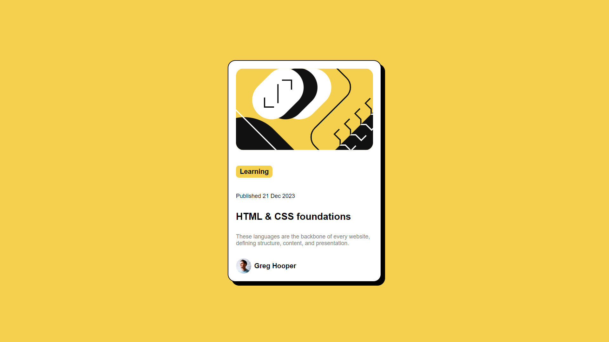

# Blog preview card

This is my solution to the Frontend Mentor challenge to create a blog preview card.

## Table of Contents

- [Overview](#overview)
  - [The Challenge](#the-challenge)
  - [Screenshot](#screenshot)
- [My Process](#my-process)
  - [Built With](#built-with)

- [Acknowledgements](#acknowledgements)

## Overview

### The Challenge

Users should be able to:

- See hover and focus states for all interactive elements on the page.

### Screenshot

## My Process

### Built With

- Semantic HTML5
- Custom CSS properties
- Flexbox

## Acknowledgements

Thanks to [Frontend Mentor](https://www.frontendmentor.io) for the design and assets. It was a great challenge to apply my HTML and CSS skills!